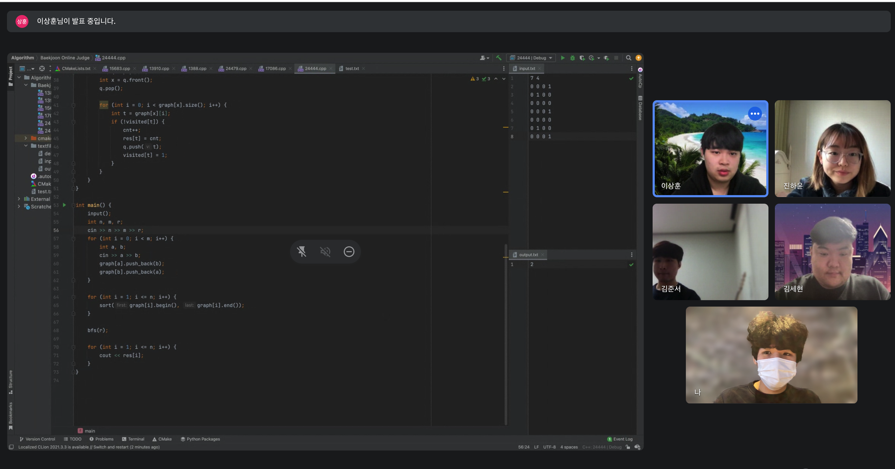

# 2023-01-28 공부 계획 정리

## 양재연
- 스프링 JPA, 데이터베이스 연동 학습

## 김세현
- 블로그 배너 수정
- 알고리즘 강의 시청
- 프로그래머스 문제 풀이

## 이상훈
- 투포인터 알고리즘 학습
- Meet in the middle 알고리즘 학습

## 김준서
- 자바스크립트 deep dive 책을 통한 자바스크립트 원리 공부

## 진하윤
- c++배열 백준 문제 풀이
- 배열 vector 학습 후 백준 문제 풀기
- 문자열 학습 후 백준 문제 풀이
</br>
</br>

# 2023-01-28 Week 3 비대면 공부 기록


</br>
</br>

# 2023-01-28 Week 3 공부 내용 정리

## 양재연

### 배운점
* 많은 웹페이지에서 OAuth 클라이언트를 사용해서 소셜 로그인 기능을 구현 하는 법을 배웠음
* 소셜 로그인 기능을 사용할 때, open API 활용법에 대해서 배웠음
### 보완점
* 소셜 로그인 기능을 구현할 때, 세션 로그인 방식을 사용했다. 세션 로그인 방식에 대한 원리를 정확하게 이해하지 못해서 기능 구현을 할 때, 헷갈리는 부분이 많았다. 로그인 방식에 대한 원리에 대한 학습이 필요하다고 느꼈다.
</br>

## 김세현

### 배운점
- 블로그 Loading Spinner 제작
- 블로그 글꼴, 마무리 사진 꾸미기
- 블로그 부드러운 이미지 효과 구현 완료
- 알고리즘 강의 시청 (https://www.youtube.com/@BaaaaaaaaaaaaaaaaaaaaarkingDog)
- 프로그래머스 문제 풀이
</br>

## 이상훈

### 배운점
- 투포인터 알고리즘 : 리스트에 순차적으로 접근해야 할 때 두 개의 점의 위치를 기록하면서 처리하는 알고리즘
- Meet in the middle : 분할정복처럼 절반씩 나누고 연산 한 다음 합치는 연산
### 보완점
- 투포인터 알고리즘인 문제를 모르고 풀 때도 투포인터 알고리즘 문제라는 걸 깨달을 수 있도록 더욱 더 많은 문제를 공부해야겠다는 생각이 들었다. 
</br>


## 김준서

### 배운점
#### 클로저


* 렉시컬 스코프</br>
  - 자바스크립트 엔진은 함수를 어디서 호출했는지가 아니라 함수를 어디에 정의했는지에 따라 상위 스코프를 결정한다. 이를 렉시컬 스코프(정적 스코프)라 한다.
  - 함수를 어디서 호출하는지는 함수의 상위 스코프 어떠한 영향도 x
  - 렉시컬 환경의 "외부 렉시컬 환경에 대한 참조"에 저장할 참조값
  - 즉 상위 스코프에 대한 참조는 함수의 정의가 평가되는 시점에 함수가 정의된 환경에 의해 결정

    
* 함수 객체의 내부 슬롯 </br>
  - 함수는 자신의 내부 슬롯에 자신이 정의된 환경 즉 상위 스코프의 참조를 저장 -> 정의된 환경과 호출 환경이 다를 경우
  - 함수 객체의 내부 슬롯에 저장된 현재 실행 중인 실행 컨텍스트의 렉시컬 환경의 참조가 바로 상위 스코프
``` javascript 
const x = 1;

function foo() {
    const x = 10;
    bar();
};
function bar() {
    console.log(x);
}

foo(); // 1
bar(); // 1

```

* 클로저와 렉시컬 환경
  - 클로저
    - 함수와 그 함수가 선언된 렉시컬 환경과의 조합 
    - 외부 함수보다 중첩 함수가 더 오래 유지되는 경우 중첩 함수는 이미 생명 주기가 종료한 외부 함수의 변수를 참조할 수 있는데 이러한 중첩 함수를 클로저라고 부른다.
    - 클로저는 중첩 함수가 상위 스코프의 식별자를 참조하고 있고, 외부 함수보다 더 오래 유지되는 경우에 한정
  - 자유 변수
    - 클로저에 의해 참조되는 상위 스코프의 변수
    - 클로저란 자유 변수에 묶여있는 함수라고 할 수 있다.


* 클로저의 활용 </br>
클로저는 상태를 안전하게 변경하고 유지하기 위해 사용한다. 상태를 안전하게 은닉하고 특정 함수에게만 상태 변경을 허용

</br>

## 진하윤

### 배운점
- c++ 배열(vector) 공부
- 배열(백준 4344번, 백준 2566번, 백준 2563번) 문제 풀기
- c++ 문자열 공부
- 문자열(백준 11654번, 백준 2743번) 문제풀기

### 보완점
- 출력값을 동적배열로 받을 때 출력이 잘 되지않아 문제해결에 시간이 오래 걸렸다. 더 연습해봐야할 것 같다.