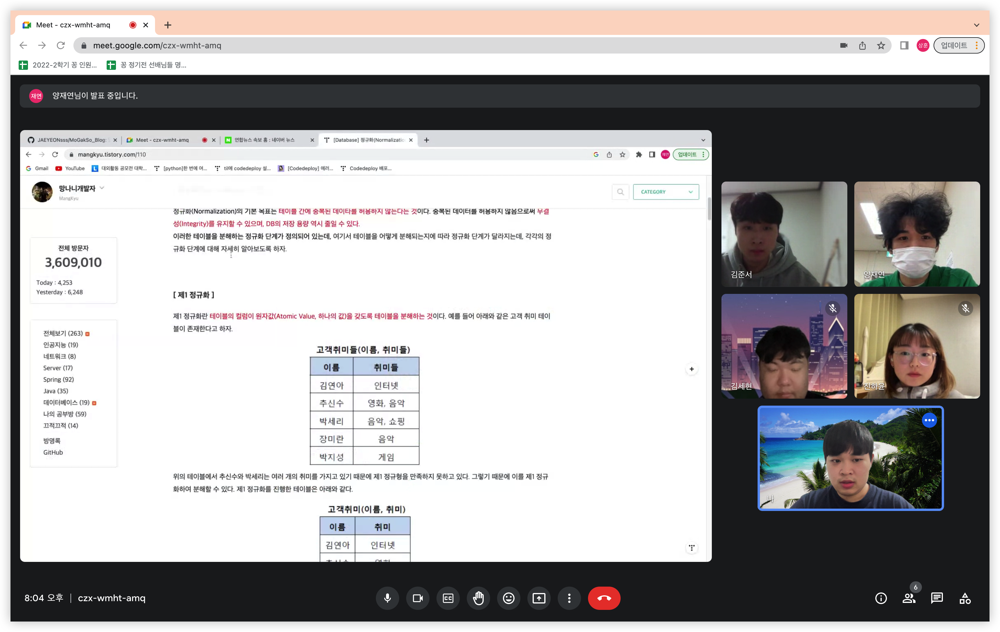

# 2023-02-15 공부 계획 정리

## 양재연
- 데이터베이스 개념 복습 및 정리
---
## 김세현
- 블로그 동영상 및 이미지 수정 완성
- 블로그 코드 리팩토링
- 블로그 소개페이지 완성
---
## 이상훈
- 삼성 A형 기출 풀기
---
## 김준서
- 자바스크립트 deep dive 책을 통한 자바스크립트 원리 공부
---
## 진하윤
- c++ 함수 공부
- c++ 함수 백준 문제 풀이
- c++ 브루트 포스 공부
- c++ 브루트 포스 백준 문제 풀이
</br>
</br>

# 2023-02-15 Week 5 비대면 공부 기록


</br>
</br>

# 2023-02-15 Week 5 공부 내용 정리

## 양재연

### 배운점

- 데이터베이스 정규화에 대한 필요성을 다시 배울 수 있게 되었다.
- 지난 2학기 때, 수업 들은 내용을 복습할 수 있었다.

### 보완점
- 지난 학기에 배운 내용임에도 잊어버린 내용이 많아서 이번 기회를 통해 복습의 중요성을 깨닫게 되었다.

</br>

## 김세현

### 배운점
- 블로그 동영상 및 이미지 수정 완료
- 블로그 코드 리팩토링 완료
- 블로그 -> 모각소 소개페이지 완성


</br>

## 이상훈

### 배운점

- <a href="https://www.acmicpc.net/problem/16235">백준 16235번</a> 소요시간 : 48분 23초 시도 횟수 : 1회
    * c++의 tuple 기능을 이용하여 bfs를 구현하였음
    * tree struct를 만들어 tree의 정보를 관리하였음
</br>
</br>

- <a href="https://www.acmicpc.net/problem/19238">백준 19238번</a> 소요시간 : 82분 52초 시도 횟수 : 2회
    * bfs를 이용하여 거리 계산을 해주었음
    * 2중 for문을 이용하여 모든 경우의 수를 다 계산하였음

</br>


## 김준서

### 배운점

#### 프로미스

* 비동기 함수 </br>
    - 비동기 함수란 함수 내부에 비동기로 동작하는 코드를 포함한 함수로 비동기 함수 내부의 비동기로 동작하는 코드는 비동기 함수가 종료된 이후에 완료
    - 비동기 함수는 비동기 처리 결과를 외부에 반환할 수 없고, 상위 스코프의 변수에 할당할 수도 없다. 따라서 비동기 함수의 처리 결과에 대한 후속 처리는 비동기 함수 내부에서 수행해야 한다.

* 프로미스 생성
``` javascript
const promise = new Promise((resolve,reject)=>{
    if(/*성공*/)
        resolve('result');
    else{
        reject('error message');
    }
})
```
Promise 생성자 함수가 인수로 전달받은 콜백 함수 내부에서 비동기 처리를 수행. 비동기 처리가 성공하면 resolve, 실패하면 reject 함수 호출.

프로미스는 비동기 처리가 어떻게 진행되고 있는지 나타내는 상태 정보 가짐

- pending: 비동기 처리가 아직 수행되지 않은 상태로 프로미스가 생성된 직후 기본 상태이다.
- fullfilled: 비동기 처리가 성공한 상태로 resolve 함수 호출
- rejected: 비동기 처리가 실패한 상태로 reject 함수 호출

fullfilled나 rejected 상태를 settled 상태라고 하며, 일단 settled 상태가 되면 더는 다른 상태로 변화할 수 없다.

또 프로미스는 처리 결과도 상태로 갖는다.

#### 즉 프로미스는 비동기 처리 상태와 처리 결과를 관리하는 객체이다.

* 프로미스의 후속 처리 메소드
    * Promise.prototype.then
        - 첫 번째 콜백 함수는 resolve 함수가 호출된 상태면 호출, 프로미스의 비동기 처리 결과를 인수로 받음
        - 두 번째 콜백 함수는 reject 함수가 호출된 상태면 호출, 프로미스의 에러를 인수로 받음


    * Promise.prototype.catch
        - reject 함수가 호출된 상태인 경우만 호출되는 콜백 함수를 인수로 받음

    * Promise.prototype.finally
        - 성공 실패와 상관없이 무조건 한번 호출 

    위 메소드들은 언제나 프로미스를 반환 -> 프로미스 체이닝 가능

* 프로미스의 정적 메서드
    * Promise.all - 여러 개의 비동기 처리를 병렬 처리할 때 사용
``` javascript
const req1 = () =>
    new Promise(resolve => setTimeOut(()=> resolve(1), 3000));
const req2 = () =>
    new Promise(resolve => setTimeOut(()=> resolve(2), 2000));
const req3 = () =>
    new Promise(resolve => setTimeOut(()=> resolve(3), 1000));

Promise.all([req1,req2,req3])
    .then(console.log); // [1,2,3] 
    .catch(console.error);
```
위 코드를 처리하는데 3초(보다 조금 더) 걸린다.

</br>

## 진하윤

### 배운점

- c++ 함수 공부
- c++ 함수 (백준 2475번, 백준 4673번) 문제 풀기
- c++ 브루트 포스 (백준 2798번, 백준2231번) 문제 풀기

### 보완점
- 브루트 포스 영역에서 반복문을 구성하는데 시간이 오래걸린다. 다양한 문제를 통해 시간을 줄여야겠다.